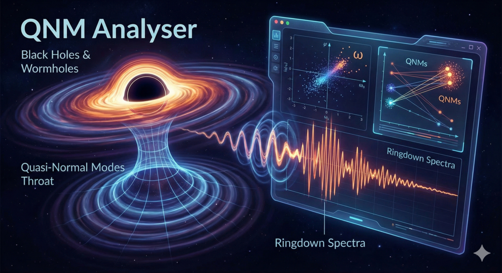

# QNM Analyser

**Online tool to analyse quasi-normal modes in gravitational physics.**

**Author:** Dr. Denys Dutykh — Khalifa University of Science and Technology,
Abu Dhabi, UAE — [https://www.denys-dutykh.com/](https://www.denys-dutykh.com/)

**Live instance:** [https://www.qnm-anal.denys-dutykh.com/](https://www.qnm-anal.denys-dutykh.com/)

<p align="center">
  
</p>

## Overview

QNM Analyser is an interactive web dashboard for exploring convergence of
quasi-normal mode (QNM) eigenvalues computed at different numerical
resolutions. It provides:

- **File upload** — drag-and-drop up to three eigenvalue files
  (two-column format: Re and Im parts of each eigenfrequency)
- **Automatic resolution detection** — resolution *N* is inferred from the
  filename (e.g. `eigs_90.dat` yields *N* = 90), editable by the user
- **Convergence analysis** — identifies QNMs that appear at all uploaded
  resolutions within a user-controlled tolerance, using KD-tree
  nearest-neighbour matching
- **Classification** — converged QNMs are categorised as general, purely
  imaginary, or purely real
- **Interactive plot** — Plotly-based scatter plot with zoom, pan, hover info,
  colorblind-safe palette (Wong 2011), and MathJax-rendered LaTeX labels
- **Dark / light theme** — toggle persisted in local storage
- **Symmetry filtering** — only Re(ω) ≥ 0 eigenvalues are shown, exploiting
  the spectrum's symmetry about the imaginary axis
- **Export** — save the current view as high-resolution PNG or PDF, download
  a formatted text report of converged QNMs (with spectral gaps Δ Im(ω)
  between consecutive purely imaginary modes), or export the raw converged
  eigenvalues as a `.dat` file

No uploaded data is stored on the server. All session state lives in the
browser and is discarded when the tab is closed.

## Data Format

Each file should contain two whitespace-separated columns:

```
Re(omega_1)  Im(omega_1)
Re(omega_2)  Im(omega_2)
...
```

Lines starting with `#` and blank lines are ignored. Values that are `NaN` or
`Inf` are silently skipped.

## Running Locally

```bash
python3 -m venv venv
source venv/bin/activate
pip install -r requirements.txt
python app.py
```

Open [http://127.0.0.1:8050](http://127.0.0.1:8050) in a browser.

## Deployment on Ubuntu VPS

See [DEPLOYMENT.md](DEPLOYMENT.md) for step-by-step instructions covering:

- Gunicorn WSGI server
- Nginx reverse proxy with HTTPS (Let's Encrypt)
- systemd service for automatic startup

## Project Structure

```
qnm-analyser/
├── app.py                         # Main Dash application
├── requirements.txt               # Python dependencies
├── gunicorn_conf.py               # Gunicorn configuration
├── assets/
│   └── style.css                  # Light/dark theme CSS
├── deploy/
│   ├── qnm-analyser.service       # systemd unit file
│   └── nginx-qnm-analyser.conf    # Nginx site configuration
├── DEPLOYMENT.md                  # Deployment guide
├── README.md                      # This file
└── LICENSE                        # LGPL v2.1
```

## Dependencies

| Package  | Purpose                           |
| -------- | --------------------------------- |
| dash     | Web framework and interactive UI  |
| plotly   | Scientific visualisation          |
| numpy    | Numerical computation             |
| scipy    | KD-tree for convergence matching  |
| kaleido  | Server-side PNG/PDF figure export |
| gunicorn | Production WSGI server            |

## Convergence Algorithm

1. Sort uploaded datasets by resolution.
2. The highest resolution serves as the reference set.
3. For each eigenvalue in the reference set, query the KD-trees of all lower
   resolutions. If the nearest neighbour distance is within the tolerance for
   **every** lower resolution, the eigenvalue is classified as converged.
4. Converged QNMs are further categorised:
   - **General** — both Re and Im parts are non-negligible
   - **Purely imaginary** — |Re| < tolerance
   - **Purely real** — |Im| < tolerance

## Licence

LGPL v2.1 — see [LICENSE](LICENSE).
