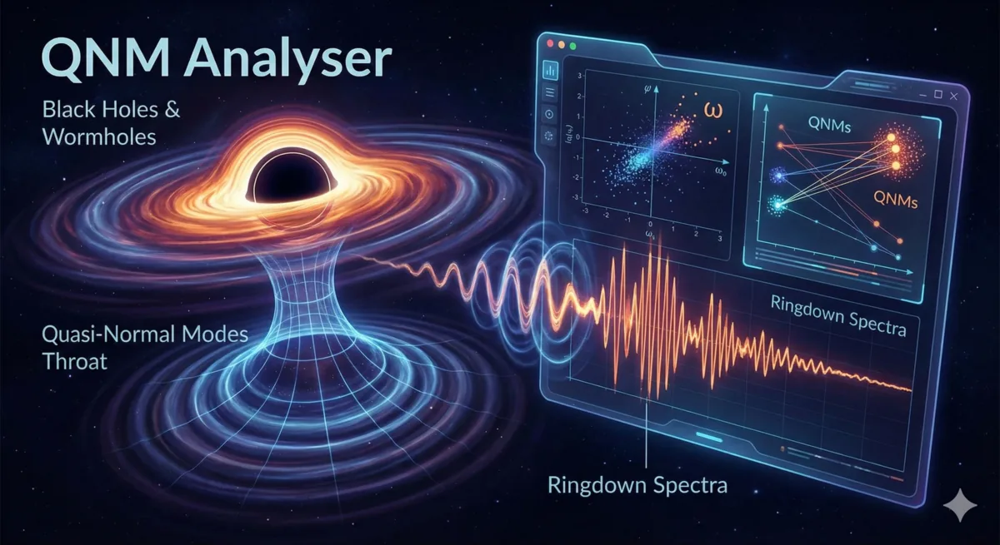

<!-- QNM Analyser
     Author: Dr. Denys Dutykh
             Khalifa University of Science and Technology, Abu Dhabi, UAE
             https://www.denys-dutykh.com/ -->

# QNM Analyser

**Online tool to analyse quasi-normal modes in gravitational physics.**

**Author:** Dr. Denys Dutykh, Khalifa University of Science and Technology,
Abu Dhabi, UAE, [https://www.denys-dutykh.com/](https://www.denys-dutykh.com/)

**Live instance:** [https://www.qnm-anal.denys-dutykh.com/](https://www.qnm-anal.denys-dutykh.com/)

<p align="center">
  
</p>

## Overview

QNM Analyser is an interactive web dashboard for exploring the convergence of
quasi-normal mode (QNM) eigenvalues computed at different numerical
resolutions. A mode that is genuine appears at every resolution; a mode that is
numerical noise does not. The tool makes that distinction visible.

- **File upload**: drag-and-drop eigenvalue files into dynamic slots (3 by
  default, expandable to 6), each holding two columns, the real and imaginary
  parts of the eigenfrequencies.
- **Automatic resolution detection**: the resolution `N` is read from the
  filename (`eigs_90.dat` gives `N = 90`, and `eigs_2024_90.dat` also gives
  `N = 90`, since the last group of digits is used). If the filename has no
  digits the tool asks you to type `N` rather than guessing.
- **Upload validation feedback**: unreadable or invalid files produce a visible
  message instead of failing silently.
- **Convergence analysis**: identifies the QNMs present at every uploaded
  resolution within a user-controlled tolerance, using KD-tree
  nearest-neighbour matching.
- **Classification**: converged QNMs are sorted into general, purely imaginary,
  and purely real.
- **Interactive plot**: Plotly scatter plot in the complex plane with zoom, pan,
  hover readout, a colourblind-safe palette (Wong 2011), and MathJax-typeset
  axis labels.
- **Click to inspect**: click any converged mode to see its value and the
  spread across resolutions.
- **Dark and light themes**: the choice is remembered in local storage.
- **Session reset**: one click clears the datasets, restores the default
  controls, and resets the plot view.
- **Symmetry filtering**: only `Re(ω) ⩾ 0` is shown, since the spectrum is
  symmetric about the imaginary axis.
- **Export**: save the current view as a high-resolution PNG or a PDF, download
  a formatted text report of the converged QNMs (including the spectral gaps
  `Δ Im(ω)` between consecutive purely imaginary modes), or write the converged
  eigenvalues out as a `.dat` file.

No uploaded data is stored on the server. All session state lives in the
browser and is discarded when the tab is closed.

## Data format

Each file holds two whitespace-separated columns:

```text
Re(omega_1)  Im(omega_1)
Re(omega_2)  Im(omega_2)
...
```

Lines beginning with `#` and blank lines are ignored. Rows that are `NaN` or
`Inf` are skipped. A single file may carry at most 100 000 eigenvalues.

## Convergence algorithm

1. Sort the uploaded datasets by resolution.
2. The highest resolution becomes the reference set.
3. For each eigenvalue in the reference set, query the KD-tree of every lower
   resolution. If the nearest neighbour lies within the tolerance for **every**
   lower resolution, that eigenvalue is converged.
4. Converged QNMs are then classified, with `tol` the chosen tolerance:

```text
   general           |Re(ω)| ⩾ tol   and   |Im(ω)| ⩾ tol
   purely imaginary  |Re(ω)| < tol   and   |Im(ω)| ⩾ tol
   purely real       |Im(ω)| < tol
```

The tolerance is set in the interface in units of `10⁻⁴`.

## Running locally

```bash
python3 -m venv venv
source venv/bin/activate
pip install -r requirements.txt
python app.py
```

Open [http://127.0.0.1:8050](http://127.0.0.1:8050).

To enable the Werkzeug debugger while developing, set `DASH_DEBUG=1`. Leave it
unset otherwise: the debugger exposes an interactive console.

## Tests

```bash
pip install -r requirements.txt -r requirements-dev.txt
pytest
```

The suite covers the upload parser, the convergence and classification
routines, the shared figure builder (including rejection of malformed zoom
ranges sent by the browser), the slot state machine, and the webhook signature
check.

To check the pinned dependencies for known vulnerabilities:

```bash
pip-audit -r requirements.txt
```

## Deployment

The live instance runs on an Ubuntu VPS under PM2, behind Traefik, and updates
itself from a GitHub webhook. See [DEPLOYMENT.md](DEPLOYMENT.md) for the full
guide, including the Traefik router and middleware configuration, operations
commands, and a troubleshooting runbook.

## Project structure

```text
qnm-analyser/
├── app.py                          # Dash application: layout, callbacks, analysis
├── webhook.py                      # GitHub deploy webhook receiver
├── gunicorn_conf.py                # Gunicorn settings (env-overridable)
├── ecosystem.config.js             # PM2 process definitions for app and webhook
├── start.sh                        # PM2 entry point for the application
├── webhook_start.sh                # PM2 entry point for the webhook
├── deploy.sh                       # Pull, install, restart, health-check
├── requirements.txt                # Runtime dependencies (exact pins)
├── requirements-dev.txt            # Test and audit tooling
├── pyproject.toml                  # pytest and ruff configuration
├── .env.example                    # Environment template
├── package.json                    # Version stamp shown in PM2 status
├── assets/
│   ├── style.css                   # Light and dark theme styles
│   └── QNM-analyser.webp           # Banner image used in this README
├── deploy/
│   └── traefik-qnm-analyser.yml    # Traefik routers, service, middlewares
├── tests/
│   ├── test_analysis.py            # Parser, convergence, figure builder
│   ├── test_slot_actions.py        # Upload/reset state machine
│   └── test_webhook_security.py    # Signature verification and deploy gating
├── DEPLOYMENT.md                   # Deployment and operations guide
├── README.md                       # This file
└── LICENSE                         # LGPL v2.1
```

## Dependencies

| Package  | Purpose                             |
| -------- | ----------------------------------- |
| dash     | Web framework and interactive UI     |
| plotly   | Scientific visualisation            |
| numpy    | Numerical computation               |
| scipy    | KD-tree for convergence matching     |
| kaleido  | Server-side PNG and PDF figure export |
| gunicorn | Production WSGI server              |
| flask    | Web framework behind the webhook    |

Versions are pinned exactly in `requirements.txt`. The application loads no
third-party scripts: MathJax is served from the application's own origin, so
the page satisfies a `script-src 'self'` content-security policy.

## Security

- Uploads are parsed as plain text only. Nothing is deserialised, evaluated, or
  written to disk.
- Upload size is capped at 10 MB by the application and again at the reverse
  proxy, and at 100 000 eigenvalues per file.
- Image export renders a figure rebuilt on the server from the uploaded
  numbers. Figure JSON from the browser is never handed to the rendering
  engine.
- The deploy webhook verifies an HMAC-SHA256 signature in constant time and
  fails closed when no secret is configured.

Please report security issues privately by email rather than opening a public
issue.

## Licence

LGPL v2.1, see [LICENSE](LICENSE).
